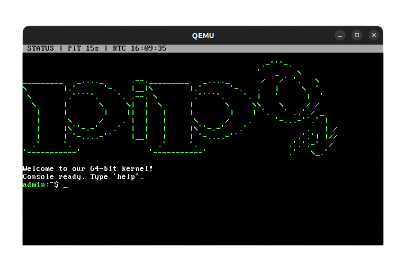

# PipOS



PipOS is a small x86_64 hobby kernel with a text-mode interface, a built-in shell, a RAM-backed filesystem, and a custom text editor (`nat`).
It is written mostly in C, with a small amount of x86_64 assembly where low-level entry points are required.

## Features

The current kernel boots into a usable text shell with a status bar, command history, `Tab` completion, and a RAM-backed filesystem. It also includes basic interrupt handling (PIT timer and PS/2 keyboard), RTC time access, panic handlers for common CPU exceptions (`#DE`, `#GP`, `#PF`), and a custom Nano-like editor called `nat`.

The shell already supports file and directory work in the RAM FS (`ls`, `cd`, `mkdir`, `touch`, `mv`, `cp`, `rm`, `rmdir`, `cat`, `stat`), plus debug/system commands like `time`, `uptime`, `ticks`, `history`, and exception trigger commands.

`nat` is designed with a PipOS identity but follows familiar Nano-style controls (`Ctrl+O` save, `Ctrl+X` quit, cursor movement, line cut/paste, refresh, etc.).

## Project Layout

```text
.
├── boot.sh
├── buildenv/
├── ext_src/
│   └── pic/
│       └── loading_screen.png
├── src/
│   ├── impl/
│   │   ├── kernel/
│   │   │   ├── main.c
│   │   │   ├── console.c
│   │   │   ├── apps/
│   │   │   │   └── nat.c
│   │   │   └── lib/x86_64/functions/
│   │   │       ├── ramfs.c
│   │   │       ├── string.c
│   │   │       └── tokenizer.c
│   │   └── x86_64/
│   │       ├── boot/
│   │       ├── idt.c
│   │       ├── idt_.asm
│   │       ├── pic.c
│   │       ├── pit.c
│   │       ├── print.c
│   │       ├── ps2.c
│   │       ├── rtc.c
│   │       └── ...
│   └── intf/
│       ├── apps/
│       │   └── nat.h
│       ├── console.h
│       ├── print.h
│       └── lib/x86_64/functions/
│           ├── ramfs.h
│           ├── string.h
│           └── tokenizer.h
└── targets/
```

## RAM FS (In-Kernel)

The shell operates on a RAM-backed filesystem created at boot. It is separate from your host filesystem and is meant for in-kernel tooling and editor workflows.

```text
/
├── bin/
├── home/
│   └── admin/
├── lib/
│   └── x86_64/
│       └── functions/
│           ├── idt.c
│           ├── port.c
│           └── print.c
└── tmp/
```

## Build and Run

You need Docker and `qemu-system-x86_64`.

Build the Docker image once:

```bash
sudo docker build buildenv -t myos-buildenv
```

Then run PipOS with one command:

```bash
./boot.sh
```

`boot.sh` builds the kernel/ISO in Docker and launches QEMU.

Manual run is also possible:

```bash
sudo docker run --rm -t -v "$(pwd):/root/env" myos-buildenv bash -lc "make build-x86_64"
qemu-system-x86_64 -cdrom dist/x86_64/kernel.iso -m 256M -display sdl
```

## Notes

The filesystem is currently RAM-only (no disk persistence yet), and `nat` edits files inside that in-kernel RAM FS. The keyboard layout is Belgian AZERTY with ASCII-oriented output for VGA text mode.

## Roadmap

Next steps include real search in `nat`, better RAM FS tooling (`write`, `append`, `grep`, recursive operations), serial COM1 logging, and eventually a disk-backed filesystem (FAT read-only first).

## License

MIT. See [`LICENSE`](LICENSE).
